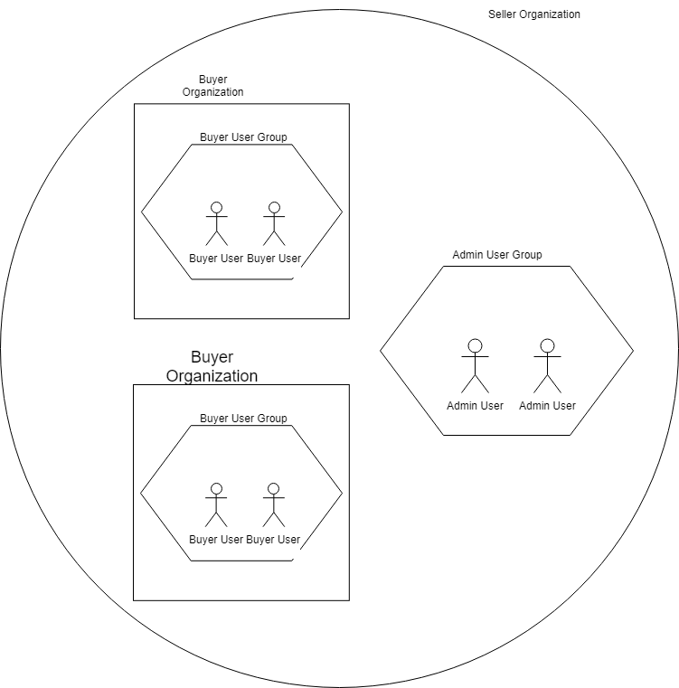

OrderCloud provides rich support for modeling a typical B2B organization. Within each organization there is a common hierarchy that is central to controlling the relationship between users and data.

The following diagram depicts the B2B organization structure as represented by Ordercloud:

## Sellers Organization

At the highest level is the seller organization; meaning, data is not meant to be shared from seller to seller. Ultimately a seller organization exists to own and manage the users, catalogs, and orders within it. The administrators who maintain the buyers' functions (for example customer service representatives or catalog/product managers) are termed seller users and belong directly to the seller organization.

## Companies

Seller organizations can also be categorized as a company, along with Buyers and Suppliers. Companies represent the unique entities within OrderCloud that transact and manage relationships with one another. Each type of company has its own purpose.

### Seller

As stated earlier, the seller is the root node of any OrderCloud solution whose main purpose is to maintain the buyers' functions. Typical functions include but are not limited to: Managing products and prices, creating and setting approval rules, defining available shipping and billing addresses for buyer users, and so on.

### Buyer

Each seller organization can contain multiple buyers. These entities do exactly what you might think, they buy products from the seller. There are various ways that buyers can be configured. For instance, OrderCloud supports buyer networks; imagine a franchise or marketplace use case where many buyer companies have access to the same buying experience. Alternatively, you can create an independent login for each buyer company to custom tailor a unique buyer experience for each company.

### Supplier

Similar to buyers, sellers can contain more than one supplier. They exist on the same hierarchical plane as buyers; however, their purpose is generally geared towards order fulfillment. Unlike sellers and buyers, suppliers are not required to create a functional OrderCloud solution.

## User Groups

Within each type of company mentioned above, user groups are available to simplify the management of a large user base. Sellers can create highly personalized experiences for users within each type of company by taking advantage of user group level relationships. Each user can be assigned to multiple groups within their company and they will inherit all of the relationships between those groups and the data associated with them. We will see more fully how this system of assignments works in the following section.

## Conclusion

![TODO:need-conclusion]
